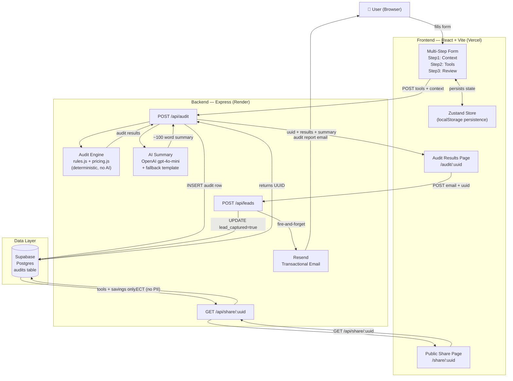
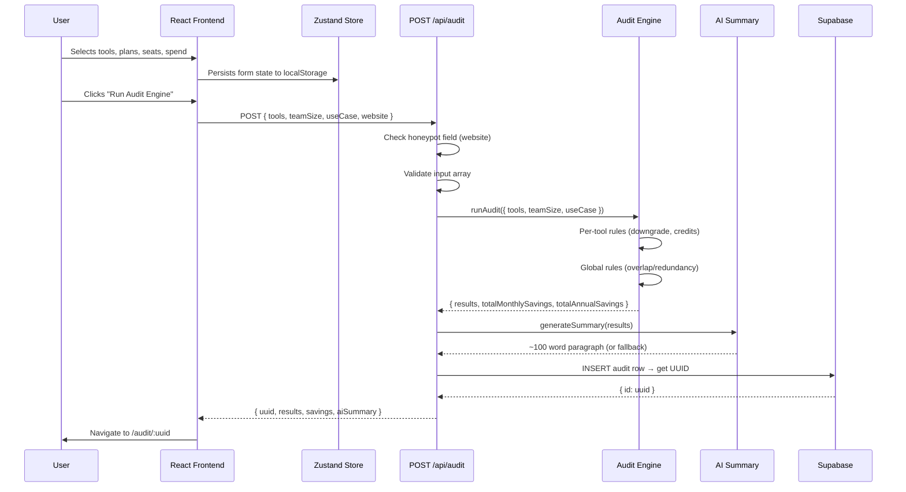

# SpendLens — Architecture

## System Overview

SpendLens is a decoupled two-tier application: a React + Vite frontend served statically, and a Node.js + Express backend handling audit logic, database writes, and email delivery. They communicate over REST. In development, Vite proxies `/api` requests to the Express server on port 5001, eliminating CORS friction. In production, they are deployed separately (Vercel + Render) and communicate directly.

---

## System Diagram



---

## Data Flow: Input → Audit Result



---

## Directory Structure

```
spendlens/
├── client/                        # React + Vite (deployed to Vercel)
│   ├── src/
│   │   ├── pages/
│   │   │   ├── Home.jsx           # Landing + multi-step form
│   │   │   ├── Audit.jsx          # Private results page (/audit/:uuid)
│   │   │   └── Share.jsx          # Public stripped page (/share/:uuid)
│   │   ├── components/
│   │   │   ├── SpendForm/
│   │   │   │   ├── Step1_Context.jsx
│   │   │   │   ├── Step2_Tools.jsx
│   │   │   │   └── Step3_Review.jsx
│   │   │   ├── AuditCard.jsx      # Per-tool result card
│   │   │   ├── HeroSavings.jsx    # Big monthly/annual savings number
│   │   │   ├── AISummary.jsx      # AI paragraph with loading skeleton
│   │   │   ├── LeadCapture.jsx    # Email gate (shown after results)
│   │   │   └── CredexCTA.jsx      # Shown only when savings > $500/mo
│   │   └── store/
│   │       └── formStore.js       # Zustand + localStorage persistence
│   └── vite.config.js             # Proxy: /api → localhost:5001 in dev
│
└── server/                        # Express (deployed to Render)
    ├── engine/
    │   ├── rules.js               # Core audit logic — deterministic rules
    │   └── pricing.js             # Pricing constants with source comments
    ├── routes/
    │   ├── audit.js               # POST /api/audit
    │   ├── leads.js               # POST /api/leads
    │   └── share.js               # GET /api/share/:uuid
    ├── ai/
    │   └── summary.js             # OpenAI call + fallback template
    ├── email/
    │   └── sender.js              # Resend transactional email
    ├── lib/
    │   └── supabase.js            # Single shared Supabase client
    └── tests/
        └── engine.test.js         # 7 Jest tests for audit engine
```

---

## Stack Decisions

### Why React + Vite (not Next.js)?
The application has no SEO-critical pages that need server-side rendering. The form and results are user-specific, interactive, and loaded after navigation — SSR adds no value here. Vite's dev server with hot module replacement is meaningfully faster than Next.js for a component-heavy UI, and the proxy configuration handles the dev/prod API routing difference cleanly without environment-specific Next.js API routes. The share page (`/share/:uuid`) is the only public-facing content where SSR would help for OG tag rendering — a limitation noted below.

### Why Express (not Next.js API routes or serverless functions)?
The audit engine is a stateless synchronous function with no I/O — it runs in milliseconds. The routes are thin wrappers around it. A full Express server gives precise control over middleware ordering (rate limiter applied only to `/api/audit`, not other routes), connection pooling via the shared Supabase client, and easier local debugging with `nodemon`. Serverless functions would have added cold start latency on Render's free tier and complicated the shared Supabase client pattern.

### Why Supabase (not MongoDB)?
The data is relational: an `audits` row has a one-to-one relationship with lead data. The audit results are queried by UUID — a primary key lookup — which Postgres handles with an index scan. Supabase's free tier includes a real Postgres instance, Row Level Security, and an auto-generated REST API. MongoDB would have worked but Postgres is the more appropriate tool for structured, relational data with UUID primary keys.

### Why Zustand (not Redux or Context)?
The form state is simple: three scalar values (step, teamSize, useCase) and an array (tools). Redux is significant overhead for this use case. React Context re-renders the entire tree on every state change. Zustand is 1.1kb gzipped, has first-class `persist` middleware for localStorage, and the store is accessible outside React components if needed. The form persistence requirement — state survives page reloads — is handled in three lines with `persist`.

### Why hardcoded rules for the audit engine (not AI)?
The brief explicitly tests whether candidates know when not to use AI. Savings calculations must be deterministic and auditable — the same inputs must always produce the same output. An LLM-based engine would introduce variability, hallucinated savings numbers, and latency. A finance person reviewing the recommendations needs to trace them back to a specific rule and a specific pricing source. Hardcoded rules with source citations achieve this; an LLM does not.

### Why OpenAI (not Anthropic) for the summary?
The brief prefers Anthropic API but explicitly allows any LLM with graceful fallback. An OpenAI API key was available during development; an Anthropic key was not. The summary generation is the one place in the product where natural language generation adds value over a template — but it is non-critical, with a full fallback in place. Swapping the client to Anthropic requires changing three lines in `server/ai/summary.js`.

---

## Abuse Protection

Two layers, both documented here per the brief's requirement:

**Honeypot field:** A hidden `<input name="website">` is rendered in the form with `display: none`, `tabIndex={-1}`, and `autoComplete="off"`. Real users never interact with it. Bots that auto-fill form fields will populate it. The server checks `req.body.website` — if non-empty, it returns a fake success response without processing the audit or writing to the database. This catches the majority of automated submissions with zero UX friction.

**Rate limiting:** `express-rate-limit` is applied specifically to `POST /api/audit` — 5 requests per IP per hour. This prevents a single actor from flooding the database or exhausting the OpenAI API quota. The limit is not applied to `/api/leads` or `/api/share` since those are lower-cost operations.

**Why not hCaptcha?** CAPTCHA adds a visible challenge before the user receives value. For a free tool with no login, this friction would measurably hurt the audit completion rate. Honeypot + rate limiting catches automated abuse without affecting real users.

---

## What I'd Change for 10,000 Audits/Day

At ~7 audits/minute sustained, several things would break or become expensive:

**1. Move to a connection pool for Supabase**
The current pattern creates one Supabase client at startup and reuses it. Under load, concurrent requests will queue on the single connection. Switching to PgBouncer (Supabase has this built in via the connection pooler endpoint) or a dedicated `pg` pool would handle concurrent writes without connection exhaustion.

**2. Queue the AI summary call**
At 10k audits/day, synchronous OpenAI API calls in the request path become a bottleneck — response times spike when the API is slow, and rate limits become a real constraint. The fix is to return the audit result immediately without the AI summary, then generate the summary asynchronously via a queue (BullMQ + Redis) and push it to the client via a webhook or polling endpoint. The fallback summary already handles the no-summary-yet state.

**3. Cache pricing data**
`pricing.js` is imported fresh on every request via `require()` (Node's module cache handles this, so it's already fine). But if pricing moved to a database or external source, a Redis cache with a 24-hour TTL would prevent repeated DB reads for static data.

**4. Add a CDN for the frontend**
Vercel already handles this — the static frontend is edge-cached globally. No change needed here.

**5. Separate read and write paths**
The share route (`GET /api/share/:uuid`) is read-only. At scale, it could be served by a read replica of the Supabase database, offloading the primary. Supabase supports read replicas on paid plans.

**6. Rate limit by user fingerprint, not just IP**
IP-based rate limiting is easily bypassed via VPN or rotating proxies. Adding a fingerprint (user-agent + IP hash + request timing) would make the honeypot + rate limit combination significantly harder to bypass at scale.

**7. Extract audit engine to a separate worker**
The audit engine is CPU-bound but fast (~1ms). At very high concurrency it could block the Node event loop. Extracting it to a worker thread pool (`worker_threads`) would keep the event loop free for I/O while audits run in parallel.

**8. Instrument everything before scaling**
Before any of the above: add structured logging (Pino), request tracing (a correlation ID on every audit), and a metrics dashboard (Supabase has basic analytics; Grafana for serious use). You can't optimize what you can't measure, and at 10k/day the bottleneck is never where you assume it is.